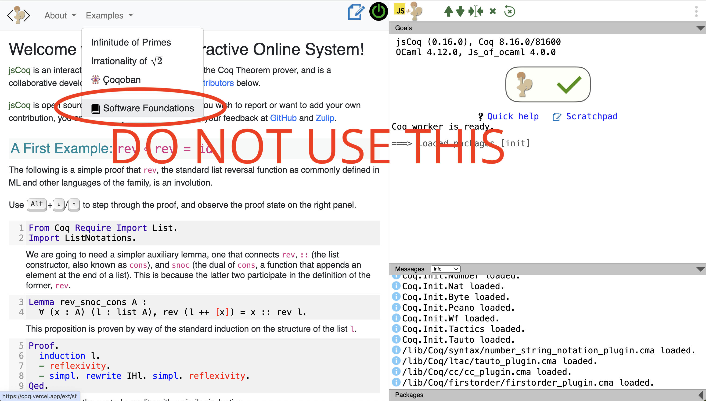

# CS292C Homework 3

**Due: May 8th, 11:59pm**


## Instructions


1. Provide your answers in [Basics.v](./Basics.v) and [Ubool.v](./Ubool.v).
2. Enter a self-grade for each problem in [self-grading.txt](./self-grading.txt).
3. Submit the following files to Gradescope:
   - Basics.v
   - Ubool.v
   - self-grading.txt

### Part 1

Read the [Basics](https://softwarefoundations.cis.upenn.edu/lf-current/Basics.html) chapter of Software Foundations, and do the following exercises:
- **Data and Functions**
  - **Numbers**:
    - Do all exercises
- **Proof by Rewriting**
  - Do:
    - `mult_n_1`
- **Proof by Case Analysis**
  - Do:
    - `andb_true_elim2`
    - `zero_nbeq_plus_1`
- **More Exercises**
  - Do all exercises

You can either read `Basics.v` source code in a text editor, or the HTML version. However, you must write your answers in `Basics.v`. You can copy and paste the content of `Basics.v` into [jsCoq](https://coq.vercel.app/) and work on the exercises there. 

**DO NOT USE THE VERSION OF SOFTWARE FOUNDATIONS IN jsCoq! It is outdated!**
> 


### Part 2

In a SAT solver, the value (of a variable/literal/clause/formula) can be either true, false, or unknown, because some variables may not have been assigned a value yet. In [Ubool.v](./Ubool.v), we represent this using the following inductive type:

```coq
Inductive ubool : Type :=
  | T
  | U
  | F
.
```

You will also find the negation function `negu`. Your tasks are:
1. Implement `andu` and `oru` by replacing `Admitted` with your own code.
2. Prove all theorems in the file. 
3. Note that there is a module called `NoDestruct`: you may NOT use the `destruct` tactic in this module. *Hint*: use the `rewrite` tactic and previously proven theorems. You will find the de Morgan's laws especially useful.

